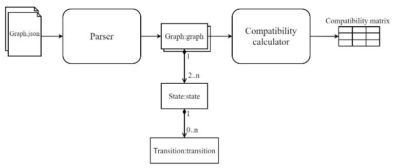

# Protocol Compatibility Measurement

## About the project

This project are python srcipts to calculate the compatibility
between the protocols, which are modeled by state machines. This project is
created to accompany with my thesis [Evaluation and development of the bridging application between ISO 15118 and OCPP 2.0.1 protocols](https://kluedo.ub.rptu.de/frontdoor/index/index/docId/7325).



The theory of the calculation is described briefly in this [paper](https://www.researchgate.net/publication/221000152_Measuring_the_Compatibility_of_Service_Interaction_Protocols).
The detail explaination is describe in [this document](documents/OSP-TR10-original.pdf).


## Getting started

### Requirements

The following packages are used for development:
* click
* pandas
* pytest

The input of the calculation a json file describing the state machine. 
The content of the json file is describe in [this document](documents/Design_Specification.md).
Furthermore, users can check the example state machines:
* [ocpp](ocpp.json)
* [iso15118](iso_15118.json)

for insparation.

### Usage

Please run the following command to start the analysis:

```python
python compatibility_calculation.py --graph YOUR_FIRST_GRAPH.json YOUR_SECOND_GRAPH.json
```

Users can test the functionalities by using two prepared sample state machines, [ocpp](ocpp.json) are [iso15118](iso_15118.json):

```python
python compatibility_calculation.py --graph ocpp.json iso_15118.json 
```

Users can execute the help command for more options:

```python
python compatibility_calculation.py --help
```

Some tests are prepare the the state machine parser module, which can be
executed with pytest:

```bash
pytest
```

## Changelog

### 1.0.0

Official release

